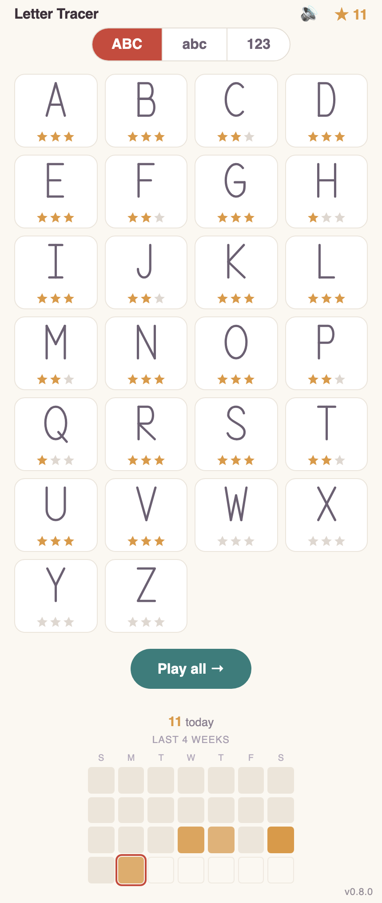
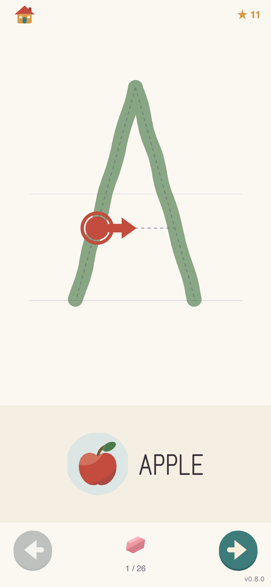

# Letter Tracer

### ▶ [mckoss.com/letter-tracer](https://mckoss.com/letter-tracer/)

Open it on a phone and add it to the home screen.

A little web app for toddlers learning to write. Pick a letter or a number, and
trace it with a finger: a hairline dashed guide shows the shape, a bouncing
arrow shows where each stroke starts and which way it goes, and a voice says
"A is for apple" as the letter comes up. Finish it and you get confetti, a
cheer, and one to three stars.

It is built for a phone held upright, installs to the home screen, and works
with no network at all.

<table>
<tr>
<td width="50%"></td>
<td width="50%"></td>
</tr>
<tr>
<td align="center"><em>Capitals, lowercase and numbers, with the best rating on each tile</em></td>
<td align="center"><em>Two strokes down, the arrow pointing along the third</em></td>
</tr>
</table>

## What it does

- **62 glyphs** — A–Z, a–z and 0–9, in a plain manuscript hand on ruled lines.
- **Correct stroke order, taught gently.** The arrow shows the next stroke in
  the order it is taught. Drawing them in any order, or backwards, still
  finishes the letter; it only costs a star.
- **Forgiving.** A stroke counts as traced once the finger has covered enough of
  it, wherever it started and whichever way it went. Nothing snaps: the line on
  screen is exactly where the finger went, wobbles and all.
- **One to three stars** per letter, best kept per glyph, on how well the strokes
  were ordered and how closely they followed the guide.
- **A spoken prompt** for each letter, in a child's voice.
- **Two sets of words**, switched from the home screen: the general set (A is
  for apple) or vehicles (A is for ambulance). Each set brings its own pictures
  and its own recordings. N, O and X keep their general word in the vehicles
  set -- there is no vehicle for them worth the confusion.
- **Progress by day** in a four-week calendar, kept in `localStorage` only.
  Nothing is uploaded, and there are no accounts.
- **Installable and offline.** Everything — letterforms, pictures, sounds — is
  precached on first load.

The word pictures and the letterforms are hand-authored SVG, drawn in a
posterised style with one shared light source -- 49 pictures across the two word
sets. See [`CREDITS.md`](CREDITS.md) for the sounds.

## Running it

Node comes from [`.nvmrc`](.nvmrc):

```sh
nvm use
npm install
npm run dev
```

To try it on a phone on the same network, `npm run dev:lan` and open the
address it prints.

```sh
npm run check   # svelte-check: types and unused CSS
npm test        # vitest, the tracing engine
npm run build   # static site into build/
npm run preview # serve build/ as it will be served
```

The tracing engine in `src/lib/trace/engine.ts` is deliberately DOM-free so it
can be unit tested; anything needing browser geometry lives in
`src/lib/glyphs/measure.ts` or in the component.

## Deploying

The live site is **<https://mckoss.com/letter-tracer/>**, served by GitHub Pages
from the `main` branch.

Pushing to `main` builds and publishes to GitHub Pages —
[`.github/workflows/deploy.yml`](.github/workflows/deploy.yml) runs `check`,
`test` and `build`, then deploys. Nothing else is needed.

The one thing to know is the base path. This is a GitHub Pages _project_ site,
so it is served under `/<repo>/` — including on the custom domain, which is
why the live URL is `mckoss.com/letter-tracer/` and not the bare domain. The
workflow passes the repository name in:

```sh
BASE_PATH=/letter-tracer npm run build
```

Leave it off and you get a site rooted at `/`, which is what `npm run preview`
and any other local serving wants. Get it wrong in the other direction and
every asset 404s.

A single relaunch picks up a new build: the service worker fetches the page
shell past the HTTP cache, so a deploy takes effect on the next launch rather
than the one after it. The version in the bottom-right corner of every screen
is there to confirm which build is actually running.

## Spoken prompts

The clips in `static/sounds/voice/phrase/` are recorded ahead of time by
[`scripts/generate_tts.py`](scripts/generate_tts.py) and committed. The app
never calls a speech service; it plays files like any other asset.

```sh
python3 -m venv .venv && .venv/bin/pip install -r scripts/requirements.txt
.venv/bin/python scripts/generate_tts.py --phrases          # all 26
.venv/bin/python scripts/generate_tts.py --phrases q --force # just re-do Q
.venv/bin/python scripts/generate_tts.py "Good job"          # any phrase
```

The script rewrites `src/lib/voice-clips.ts` with the letters that have a clip,
so a letter with nothing recorded simply stays quiet. See `CREDITS.md` for the
licensing position on the voice.

## Where things are

|                                        |                                                     |
| -------------------------------------- | --------------------------------------------------- |
| `src/lib/glyphs/data.ts`               | every letterform, as ordered SVG path strings       |
| `src/lib/trace/engine.ts`              | the tracing engine: pure geometry, unit tested      |
| `src/lib/components/TraceStage.svelte` | the tracing screen                                  |
| `src/lib/art/`                         | the word pictures and the posterised shading        |
| `src/service-worker.ts`                | the precache that makes it work offline             |
| [`PLAN.md`](PLAN.md)                   | the design decisions, and what is still on the list |
